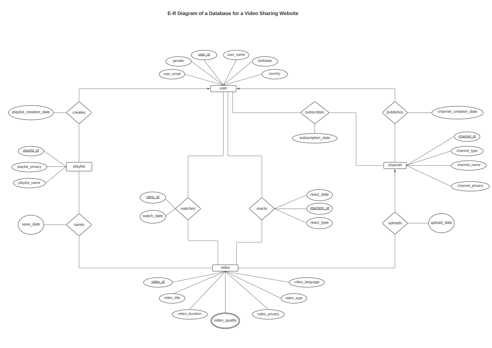
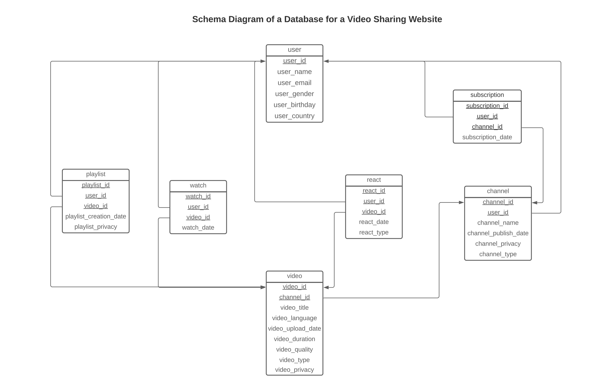

# Video Streaming Site DBMS

## Project Overview

This project implements a Database Management System (DBMS) for a video streaming platform, similar to YouTube. It provides functionalities for managing users, channels, subscriptions, videos, playlists, and interactions (such as likes and views). The system uses SQL queries to handle and manipulate data efficiently. The project involves a variety of features, including data modification, aggregation, joins, and PL/SQL procedures.

## Database Structure
## Database Structure

The DBMS schema is represented in the following diagrams:

### E-R Diagram


### Schema Diagram

The DBMS consists of the following tables:

1. **users**: Stores user information, including their ID, name, email, gender, birth date, and country.
2. **channel**: Stores information about channels, including channel ID, user ID (who owns the channel), channel name, type, and privacy settings.
3. **subscription**: Stores data about users subscribing to channels, with subscription ID, user ID, channel ID, and subscription date.
4. **video**: Stores information about videos, including video ID, channel ID, title, language, upload date, duration, type, and privacy.
5. **videoQuality**: Stores the available video qualities (e.g., 360p, 720p) for each video.
6. **playlist**: Stores playlists created by users, including playlist ID, user ID, name, creation date, and privacy.
7. **playlistVideos**: Stores information about the videos added to playlists, including playlist ID, video ID, and the date the video was saved to the playlist.
8. **watch**: Stores records of user video views, including user ID, video quality, and watch date.
9. **react**: Stores reactions (likes/dislikes) for videos, including user ID, video ID, reaction type (like/dislike), and reaction date.

## Key Features

### Data Modification (DML)

- **Adding, Modifying, and Deleting Columns**: The project allows adding, modifying, and deleting columns in tables to manage evolving requirements (e.g., adding a new column for user religion or modifying video durations).
- **Data Update**: Uses `UPDATE` statements to modify existing data based on conditions. For example, updating video reactions or deleting subscriptions.
  
### Select Queries

- **Calculated Fields**: Calculates video duration in hours and other derived values.
- **Search Operations**: Includes basic `SELECT` queries with `WHERE`, `IN`, and `BETWEEN` clauses to filter and retrieve relevant data.
- **String Searches**: Allows searching for emails or other string patterns using the `LIKE` operator.
- **Aggregations**: Uses aggregate functions (`COUNT`, `MAX`, `MIN`, `SUM`, `AVG`) to calculate statistics like total views, average video duration, etc.
- **Grouping and Having**: Groups data based on certain fields (like video privacy) and applies aggregate functions to filter the results further.
  
### Joins

- **Inner Join**: Retrieves data that matches from multiple tables, like finding videos in the 'Educational' channel that have been liked.
- **Outer Join**: Supports various types of joins (left, right, full) to retrieve data even if there are no matching entries in one of the tables (e.g., counting the likes of videos).
- **Cross Join**: Generates a Cartesian product of two tables, useful for finding combinations of channel names and subscription dates.

### Subqueries and Set Operations

- **Subqueries**: Allows for complex queries by embedding another query within the `WHERE` clause, such as finding videos that are publicly available and liked.
- **Set Operations**: Supports `UNION`, `INTERSECT`, `MINUS` for combining results from different queries, such as finding videos that either belong to 'Educational' channels or are in 1080p quality.

### PL/SQL

- **Procedures and Logic**: Implements PL/SQL code to classify videos based on their duration (short, standard, long).

## How to Run the Project

### Prerequisites
1. **Database Setup**: You should have a working database like Oracle or MySQL. The database schema can be easily created using the SQL scripts provided in the project.
2. **SQL Client**: Use any SQL client (like Oracle SQL Developer, MySQL Workbench, etc.) to interact with the database.
3. **PL/SQL Support**: Make sure your SQL environment supports PL/SQL for running stored procedures.

### Setting Up the Database

1. **Create Database**: 
    ```sql
    CREATE DATABASE video_streaming;
    ```

2. **Run Schema Creation**: Execute the provided SQL scripts to create all necessary tables (users, channels, videos, etc.).

3. **Insert Sample Data**: Insert the sample data provided in the SQL script into the relevant tables.

4. **Execute Queries**: Use the `SELECT`, `UPDATE`, `DELETE`, and `INSERT` queries provided in the project to interact with the database and retrieve or modify data.

### Example Commands

```sql
-- Get all educational videos that are liked
SELECT video_title 
FROM video 
WHERE video_id IN (
    SELECT v.video_id 
    FROM channel c, video v 
    WHERE c.channel_id = v.channel_id AND c.channel_type = 'Educational'
    INTERSECT
    SELECT DISTINCT(r.video_id)
    FROM react r
    WHERE r.react_type = 'like'
);

-- Get the total count of 'likes' for the video 'Tajmahal tour'
SELECT COUNT(r.react_type) 
FROM video v LEFT OUTER JOIN react r
ON v.video_id = r.video_id
WHERE v.video_title = 'Tajmahal tour' AND r.react_type = 'like';
```

## Contribution

Feel free to fork this repository, modify the code, and submit pull requests. You can contribute by adding new features, fixing bugs, or improving the documentation.

## License

This project is licensed under the MIT License - see the [LICENSE](LICENSE) file for details.

---

This README is structured to guide users through setting up the project, understanding the database structure, and interacting with the DBMS using SQL queries. Let me know if you'd like any changes or additions!
